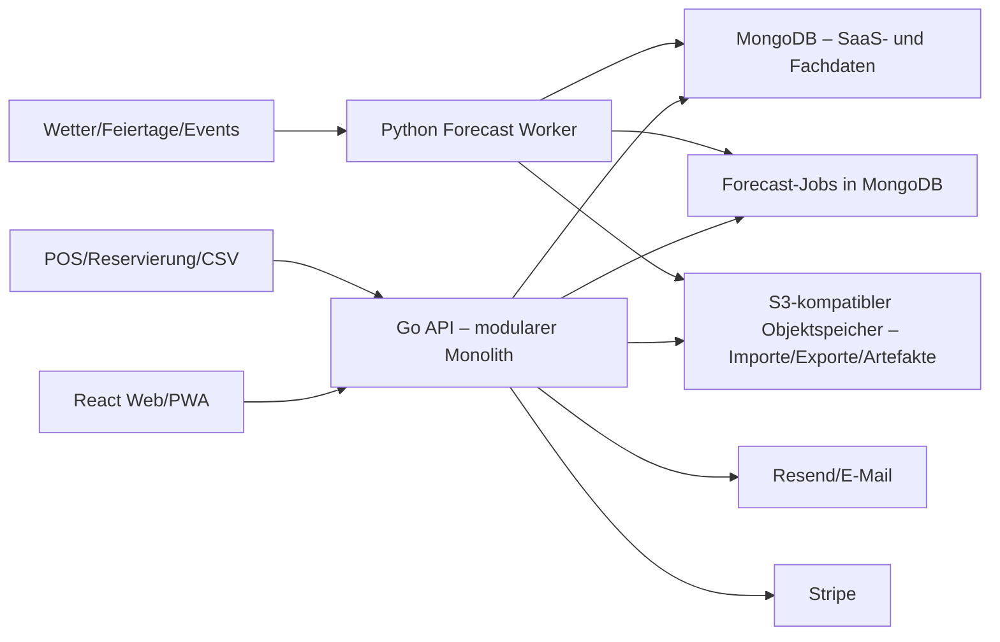

# Bauplan: Restaurant-Warenwirtschaft als SaaS mit Forecasting

Stand: 17. Juli 2026

## 1. Zielbild

Das Produkt wird eine mandantenfähige Restaurant-Warenwirtschaft für kleine und mittlere Gastronomiebetriebe. Ein SaaS-Mandant entspricht einem Unternehmen; ein Unternehmen kann mehrere Restaurants bzw. Standorte verwalten.

Der Betreiber dieses Produkts ist der SaaS-Anbieter und kein Restaurantnutzer. Restaurants registrieren sich als Kunden-Tenants und erledigen ihre laufende Einrichtung selbst. Dazu gehören Restaurantname, Logo, Farben, Kontaktdaten, Dokumentdarstellung, Benutzer, Standorte und Integrationen. Der SaaS-Anbieter verwaltet nur die Plattformmarke, Tarife, systemweite Konfiguration, Support und Betrieb.

Der erste verkaufbare Produktkern beantwortet täglich vier Fragen:

1. Was ist je Standort und Lagerort tatsächlich verfügbar?
2. Welche Artikel laufen bald ab oder werden voraussichtlich knapp?
3. Wie viele Gäste und welche Verbräuche sind in den nächsten Tagen zu erwarten?
4. Was sollte wann und in welcher Packungsgröße bestellt werden?

Die Anwendung ersetzt im MVP weder eine fiskalisierte Kasse noch Finanzbuchhaltung. Kassendaten werden importiert oder über Integrationen synchronisiert. Bestellvorschläge benötigen immer eine menschliche Freigabe.

## 2. Planungsannahmen

- Zielmarkt zunächst DACH/EU.
- Responsive Web-App für Desktop, Tablet und Smartphone; keine native App im MVP.
- Ein Mandant kann mehrere Standorte, Lagerbereiche und Benutzer haben.
- Jeder Restaurant-Tenant verwaltet sein Branding im Self-Service; der Plattformbetreiber muss dafür nicht tätig werden.
- Die Plattformmarke, Tenant-Marke und optionale Standortmarke sind technisch getrennte Scopes.
- CSV-Import ist die erste universelle POS-, Verkaufs- und Stammdatenintegration.
- Deutsch ist die erste Produktsprache; Internationalisierung wird technisch vorbereitet.
- MongoDB bleibt im MVP die Hauptdatenbank, damit die bestehende Boilerplate ohne zweite operative Datenbank erweitert werden kann.
- Forecasting startet mit robusten statistischen Baselines und wird datenabhängig um ML-Modelle erweitert.
- Rechnungs-OCR, automatische Bestellung, vollständige Buchhaltung und eine eigene Kasse gehören nicht zum MVP.

## 3. Bewertung der LastSaaS-Boilerplate

### Direkt wiederverwenden

- Go-Backend mit `gorilla/mux`
- React 19, TypeScript, Vite, Tailwind und Recharts
- MongoDB-Anbindung, Indexe und JSON-Schema-Validierung
- Registrierung, Login, OAuth, Magic Links, MFA, Passkeys und Session-Verwaltung
- Mandanten, Mitgliedschaften und Tenant-Middleware
- Stripe-Pläne, Entitlements, Abrechnung und Billing Portal
- Team-Einladungen, Audit-/Aktivitätsprotokoll und System-Logs
- API-Keys, ausgehende Webhooks und Telemetrie
- Adminbereich, globale Plattform-Branding-Basis, Health Checks und Docker-Deployment

### Fachlich erweitern

- Unternehmen/Standorte/Lagerbereiche
- Fachrollen und Standortfreigaben
- Artikel, Einheiten, Lieferanten und Einkaufskonditionen
- Rezepte, Rezeptversionen und Menü-/POS-Zuordnung
- Bestandsjournal, Chargen, Ablaufdaten und Inventuren
- Einkauf, Bestellungen, Wareneingang und Abfall
- Verkaufs-/Reservierungsimport
- Bedarfs-, Gäste- und Reichweitenprognosen
- Bestellvorschläge, Warnungen und operative Dashboards
- Tenant-Self-Service-Branding und optionale Standort-Overrides

### Wichtige technische Feststellung

Die heruntergeladene Version enthält widersprüchliche Deployment-Hinweise: Die README beschreibt ein einzelnes Go/React-Image und `fly deploy`; `CLAUDE.md` verlangt für abhängige Projekte dagegen `Dockerfile.saas` und `fly.saas.toml`, die im Archiv nicht vorhanden sind. Deshalb wird das Produkt als direkter Fork im selben Backend gebaut, nicht als zweites abhängiges Produkt-Backend. Vor dem ersten Deployment müssen README, `CLAUDE.md` und die reale Deployment-Architektur vereinheitlicht werden.

## 4. Produktumfang

### MVP – Pilotfähig

1. Mandant, Standorte, Lagerbereiche und Öffnungszeiten
2. Fachrollen und Standortzugriffe
3. Self-Service-Branding mit Restaurantname, Logo, Farben, Kontaktdaten sowie E-Mail-/PDF-Darstellung
4. Artikelstamm, Kategorien, Einheiten und Umrechnungen
5. Lieferanten, Lieferartikel, Preise, Lieferzeiten, Packungsgrößen und Mindestmengen
6. Anfangsbestand, Wareneingang, Verbrauch, Transfer, Abfall und Korrektur
7. Chargen, Mindesthaltbarkeit und FEFO-Vorschläge
8. Inventuren mit mobilen Zähllisten
9. Rezepte, Unterrezepte, Ausbeute-/Verlustfaktoren und Rezeptversionen
10. CSV-Import von Verkäufen, Reservierungen, Artikeln und Beständen
11. Theoretischer Verbrauch aus Verkäufen und Rezepten
12. Dashboard für Bestand, Abweichungen, Ablauf und drohende Engpässe
13. Gästeprognose, Artikelbedarf, Lagerreichweite und Bestellvorschläge
14. E-Mail-/In-App-Warnungen und Export
15. Stripe-Pläne und Feature-/Standortlimits

### Version 1 – Verkaufbares SaaS

- Erste native POS- und Reservierungsadapter
- Wiederkehrende Bestellpläne und Lieferkalender
- Preisverlauf, Wareneinsatz, Deckungsbeitrag und Soll/Ist-Verbrauch
- Freigabeprozess für Bestellungen
- Lieferanten-E-Mail/PDF-Bestellung
- Barcode-/Kamera-Scanning als PWA
- Temperaturkontrollen und erweiterte HACCP-nahe Dokumentation
- Prognoseerklärungen, Szenarien und Modellgüte pro Standort
- Webhooks und API für externe Systeme
- Datenimport-Assistent mit Mapping-Vorlagen
- optionale Standort-Branding-Overrides, Custom Domains und vollständiger White-Label-Modus

### Später / ausdrücklich nicht MVP

- Eigene Kasse oder Zahlungsabwicklung am Tisch
- Fiskalisierung nach RKSV/KassenSichV
- Vollständige Kreditorenbuchhaltung oder Steuerabschluss
- Autonome Bestellungen ohne Freigabe
- Rechnungs-OCR mit automatischer Verbuchung
- Lieferantenmarktplatz/EDI für viele Großhändler
- Native iOS-/Android-Apps
- Cross-Tenant-Training ohne ausdrückliche Einwilligung und Datenschutzkonzept

## 5. Zielarchitektur



### Architekturregeln

- Das Go-Backend bleibt Eigentümer aller Geschäftsregeln und Schreiboperationen.
- Der Python-Worker berechnet Prognosen, darf aber keine Bestände oder Bestellungen buchen.
- Alle fachlichen Dokumente enthalten `tenantId`; standortbezogene Dokumente zusätzlich `locationId`.
- Tenant- und Standortfilter werden serverseitig erzwungen, niemals dem Frontend überlassen.
- Branding wird in der Reihenfolge Standort-Override → Tenant-Branding → Plattform-Default aufgelöst.
- Der Root-/Plattform-Admin verwaltet nur das SaaS-Branding. Restaurant-Owner und berechtigte Restaurant-Admins verwalten ihr Tenant-Branding ohne Eingriff des SaaS-Anbieters.
- Tenant-Branding darf keine frei ausführbaren Skripte, beliebiges HTML oder unkontrolliertes CSS enthalten.
- Neue fachliche Module liegen getrennt von den SaaS-Kernmodulen, nutzen aber deren Auth-, Billing-, Logging- und Event-Infrastruktur.
- Forecast-Jobs werden über eine MongoDB-Collection mit Leasing, Retry, Status und Idempotenz verarbeitet. Redis oder ein separater Message Broker ist für das MVP nicht erforderlich.
- Externe Integrationen werden über Adapter auf ein internes, versioniertes Normalformat abgebildet.

### Empfohlene Modulstruktur

```text
backend/internal/
  restaurant/        Standorte, Einstellungen, Fachrollen
  catalog/           Artikel, Einheiten, Kategorien
  suppliers/         Lieferanten und Lieferartikel
  recipes/           Rezepte, Versionen, POS-Zuordnung
  inventory/         Journal, Salden, Chargen, Inventuren
  purchasing/        Bestellungen und Wareneingang
  sales/             Verkaufs-, Gäste- und Reservierungsdaten
  integrations/      CSV und externe Adapter
  forecasting/       Jobs, Resultate, Bestellvorschläge
  alerts/            Regeln und Benachrichtigungen

forecast-worker/
  app/                Job-Runner und Datenzugriff
  features/           Feature Engineering
  models/             Baselines und ML-Modelle
  evaluation/         Rolling Backtests und Gütemetriken

frontend/src/
  features/           Fachlich geschnittene UI-Module
  pages/app/          Route-Level Seiten
  api/                Fach-Clients und DTOs
```

## 6. Mandanten-, Standort- und Berechtigungsmodell

Die bestehenden Kernrollen `owner`, `admin`, `user` bleiben für SaaS-/Mandantenverwaltung erhalten. Gastronomierollen werden separat modelliert, damit Änderungen an der Boilerplate klein bleiben.

### Anbieter und Restaurant-Tenant

| Scope | Verantwortlich | Inhalt |
|---|---|---|
| Plattform | SaaS-Anbieter/Root-Tenant | Produktname, Marketingseite, öffentliche Login-/Signup-Seiten, globale E-Mail-Defaults, Tarife, Betrieb |
| Restaurant-Tenant | Restaurant-Owner bzw. berechtigter Admin | Restaurant-/Unternehmensname, Logo, Farben, Kontaktdaten, Dokumentkopf, Absendername und operative Einstellungen |
| Standort | Restaurant-Owner/Manager mit Recht | optionale abweichende Marke, Anschrift, Telefon, E-Mail und Dokumentdaten einer Filiale |

Öffentliche Seiten vor Tenant-Auswahl tragen die Plattformmarke. Nach Tenant-Auswahl verwendet die App das Tenant-Branding. Bei standortbezogenen Dokumenten oder Ansichten gewinnt ein vorhandenes Standort-Override. Basis-Branding ist kein Root-Admin-Serviceprozess, sondern Teil des Restaurant-Onboardings.

### Fachrollen

| Rolle | Typische Rechte |
|---|---|
| Unternehmensinhaber | alle Standorte, Einkauf, Kosten, Forecast, Einstellungen |
| Betriebsleiter | freigegebene Standorte, Bestände, Einkauf, Reports |
| Küchenchef | Rezepte, Verbrauch, Inventur, Bestellvorschläge |
| Einkauf | Lieferanten, Preise, Bestellungen und Wareneingang |
| Lager/Service | Zählen, Wareneingang, Transfers, Abfall |
| Controlling | Kosten und Reports, grundsätzlich lesend |
| Viewer | lesender Zugriff auf freigegebene Bereiche |

Collection `staff_profiles`:

- `tenantId`, `userId`
- `businessRole`
- `locationIds` oder `allLocations`
- optionale Rechte-Overrides
- Status und Zeitstempel
- eindeutiger Index auf `(tenantId, userId)`

Jeder Handler prüft in dieser Reihenfolge: Authentifizierung → Tenant-Mitgliedschaft → aktives Billing/Entitlement → Standortzugriff → Fachrecht.

## 7. Fachliches Datenmodell

### Stammdaten

| Collection | Zweck | Wichtige Felder/Indexe |
|---|---|---|
| `restaurant_settings` | Einstellungen je Mandant | eindeutiges `tenantId`, Währung, Sprache, Default-Zeitzone |
| `tenant_branding` | Self-Service-Marke des Restaurantkunden | eindeutiges `tenantId`, Name, Logos, Theme-Tokens, Kontakt-/Dokumentdaten, Version |
| `location_branding` | optionale Filialabweichung | unique `(tenantId, locationId)`, nur erlaubte Overrides, Version |
| `tenant_branding_assets` | tenantisolierte Logos/Bilder | `tenantId`, optional `locationId`, Typ, MIME, Größe, Storage-Key, Prüfsumme |
| `locations` | Restaurants/Filialen | `tenantId`, Name, Zeitzone, Adresse, Öffnungszeiten; unique `(tenantId, code)` |
| `storage_areas` | Kühlung, Tiefkühlung, Bar, Trockenlager | `tenantId`, `locationId`, Typ, aktiv |
| `units` | Basis-/Kauf-/Rezepteinheiten | global oder `tenantId`, Dimension, Präzision |
| `items` | Zutaten, Getränke, Verpackungen | Basis-Einheit, Kategorie, Allergene, Haltbarkeit, stockable; unique `(tenantId, sku)` |
| `item_conversions` | Artikelspezifische Umrechnung | z. B. Kiste→Flasche, kg→Portion; unique je Artikel/Einheitspaar |
| `suppliers` | Lieferantenstamm | Kontaktdaten, Bestelltage, Standard-Lieferzeit |
| `supplier_items` | Konditionen je Lieferant/Artikel | Bestellnummer, Packgröße, Mindestmenge, Preis, Lieferzeit |
| `recipes` | Logische Rezepte/Unterrezepte | `tenantId`, Name, Ausgabeeinheit, Portionen |
| `recipe_versions` | Zeitlich gültige Rezepturen | Komponenten, Verlust/Ausbeute, gültig ab/bis, Freigabestatus |
| `external_product_mappings` | POS-Produkt → Rezept/Menüartikel | Adapter, externe ID, Rezeptversion, Gültigkeit |

### Operative Daten

| Collection | Zweck | Wichtige Felder/Indexe |
|---|---|---|
| `stock_movements` | unveränderliches Bestandsjournal | Tenant, Standort, Lagerort, Artikel, Charge, Typ, Menge, Kosten, Quelle, `effectiveAt`, `recordedAt`; unique Idempotenzschlüssel |
| `stock_balances` | schnell lesbarer aktueller Saldo | unique `(tenantId, locationId, storageAreaId, itemId, lotId)` |
| `stock_lots` | Charge/MHD/Status | Charge, MHD, Wareneingang, verfügbar/quarantänisiert |
| `stock_counts` | Inventurkopf und Workflow | Status draft/counting/reviewed/posted, Stichtag, Lagerbereiche |
| `stock_count_lines` | Soll-/Ist-Mengen und Differenz | unique `(stockCountId, itemId, lotId, storageAreaId)` |
| `purchase_orders` | Bestellung und Freigabe | Nummer, Lieferant, Standort, Status, Lieferdatum, Zeilen |
| `goods_receipts` | Wareneingang gegen Bestellung | gelieferte Mengen, Chargen, MHD, Abweichungen |
| `waste_events` | Grund und Nachweis für Ausschuss | Artikel/Charge, Menge, Kosten, Grund, optional Foto |
| `sales` | normalisierte Verkaufsköpfe | externe ID, Bonzeit, Standort, Status; unique je Quelle |
| `sales_lines` | verkaufte Produkte und Mengen | Produktmapping, Menge, Umsatz, Storno; hohe Schreiblast separat |
| `guest_actuals` | tatsächliche Gäste/Covers | Standort, Tag, Serviceperiode, Quelle |
| `reservations` | Reservierungen und Buchungskurve | Gästezahl, Zeitpunkt, Status, erstellt/geändert |
| `integration_connections` | Adapterkonfiguration | verschlüsselte Credentials, Standortmapping, Sync-Cursor |
| `integration_sync_runs` | Import-/Sync-Audit | Status, Cursor, Zeilenzahlen, Fehlerdatei, Idempotenz |

### Forecasting-Daten

| Collection | Zweck |
|---|---|
| `forecast_jobs` | Job-Leasing, Retry, Priorität und Status |
| `forecast_runs` | Modell, Trainingsfenster, Feature-Version, Metriken und Laufstatus |
| `forecast_points` | Prognose je Ziel/Tag/Serviceperiode mit P10/P50/P90 |
| `reorder_recommendations` | Bedarf, verfügbar, unterwegs, Sicherheitsbestand, Rundung und Begründung |
| `forecast_overrides` | manuelle Korrekturen mit Grund und Benutzer |
| `model_performance` | Rolling-Backtest, Baselinevergleich und Kalibrierung |

### Zahlen und Zeit

- Bestandsmengen werden als Fixed-Point-Integer gespeichert, z. B. `quantityMicros int64`; keine binären Floats für Buchungen.
- Preise/Kosten werden als `int64` in kleinster Währungseinheit plus Währung gespeichert.
- Umrechnungen werden als rationale Faktoren oder kontrollierte Dezimalwerte gespeichert.
- Jeder Standort besitzt eine IANA-Zeitzone. Speicherung erfolgt in UTC; operative Tage/Serviceperioden werden in Standortzeit abgeleitet.
- `effectiveAt` beschreibt den fachlichen Zeitpunkt, `recordedAt` den Erfassungszeitpunkt. Das ist für nachträgliche POS-Importe und Forecast-Training entscheidend.

## 8. Bestandsjournal: verbindliche Invarianten

1. Gebuchte Bewegungen werden nie überschrieben oder gelöscht; Fehler werden durch Gegenbuchung korrigiert.
2. Journalbuchung und Saldoänderung erfolgen in einer MongoDB-Transaktion.
3. Jede externe Quelle besitzt einen eindeutigen Idempotenzschlüssel.
4. Ein Transfer erzeugt atomar Ausgang und Eingang.
5. Ein Wareneingang erzeugt Charge, Bewegung und Saldo atomar.
6. Eine freigegebene Inventur erzeugt ausschließlich Differenzbuchungen.
7. Negative Bestände sind je Mandant konfigurierbar; standardmäßig Warnung und nur mit Recht/Begründung erlaubt.
8. Verbrauch erfolgt bei Chargen standardmäßig nach FEFO; Kostenbewertung im MVP nach gleitendem Durchschnitt.
9. Alle Buchungen enthalten Tenant, Standort, Benutzer/Quelle und Audit-Metadaten.
10. Rezept- und Produktmapping wird zum Verkaufszeitpunkt versioniert, damit historische Verbräuche reproduzierbar bleiben.

### Bewegungsarten

- `opening_balance`
- `goods_receipt`
- `sale_consumption`
- `production`
- `transfer_out` / `transfer_in`
- `waste`
- `count_adjustment`
- `manual_adjustment`
- `return_to_supplier`
- `reversal`

## 9. Kernabläufe

### Onboarding

1. Account/Mandant anlegen und Plan wählen.
2. Ersten Standort, Zeitzone und Öffnungszeiten einrichten.
3. Artikel/Lieferanten per Vorlage importieren.
4. Einheiten und Packungsgrößen validieren.
5. Anfangsinventur durchführen.
6. Rezepte oder POS-Produkte importieren und zuordnen.
7. Verkaufs-/Reservierungsquelle verbinden oder CSV hochladen.
8. Forecast startet zunächst im Baseline-/Shadow-Modus.

Ziel: Ein Betrieb soll in unter 60 Minuten einen belastbaren Anfangsbestand und erste Reichweiten sehen können. Rezepte und Integrationen dürfen danach schrittweise vervollständigt werden.

### Wareneingang

Bestellung wählen → gelieferte Mengen/Preise prüfen → Charge und MHD erfassen → Abweichung markieren → buchen → Bestand und Bestellstatus aktualisieren.

### Verkauf zu Verbrauch

POS-Zeile normalisieren → externe ID deduplizieren → gültiges Produkt-/Rezeptmapping bestimmen → Rezeptkomponenten auflösen → theoretische Verbrauchsbewegungen erzeugen → Storno als Gegenbewegung buchen.

### Inventur

Zählliste einfrieren → blind oder mit Sollbestand zählen → Differenzen prüfen → Vier-Augen-Freigabe optional → Differenzbewegungen buchen → Abweichungsreport erstellen.

### Bestellung

Forecast und Mindestbestand berechnen → offene Bestellungen abziehen → Packungsgröße/MOQ/Liefertag runden → Vorschlag erklären → Benutzer ändert/freigibt → Bestellung versenden/exportieren.

## 10. Forecasting-Konzept

### Grundsatz

Numerische Prognosen kommen aus statistischen bzw. ML-Modellen, nicht aus einem Sprachmodell. Ein LLM kann später Begründungen zusammenfassen oder einen Analyse-Chat bereitstellen, darf aber keine Bestände oder Bestellmengen frei erfinden.

### Prognose 1: Erwartete Gäste

Zielgranularität: Standort × Betriebstag × Serviceperiode (Frühstück/Mittag/Abend) mit P10/P50/P90.

Features:

- Wochentag, Monat, Saison, Trend und Ferien/Feiertage
- Öffnungszeiten und geplante Schließtage
- Reservierungsstand und Buchungsgeschwindigkeit
- historische Gäste und No-Show-Quote
- Wetter und Wetteränderung
- lokale Veranstaltungen, Aktionen und Sonderkarten
- Sitzplatzkapazität und ausverkaufte Zeitfenster

Modelle:

- Baseline: gleicher Wochentag der letzten Wochen, gleitender/gewichteter Mittelwert
- Danach: exponentielle Glättung und robuste saisonale Modelle
- Bei genügend Daten: Gradient-Boosting-Modell mit Quantilprognosen
- Pro Standort gewinnt im Rolling Backtest das Modell, das die Baseline stabil schlägt

### Prognose 2: Zutaten-/Artikelbedarf

Zwei parallele Ansätze:

1. Bottom-up: erwartete Gäste × erwarteter Menü-Mix × Rezeptmengen × Verlust-/Ausbeutefaktor.
2. Direct demand: Zeitreihenmodell auf tatsächlichem Verbrauch je Artikel.

Das System kombiniert beide Ansätze anhand historischer Güte. Artikel mit sporadischem Bedarf erhalten eine Intermittent-Demand-Baseline statt eines ungeeigneten Standardmodells.

### Prognose 3: Lagerreichweite und Stockout

Ein einfacher Quotient `Bestand / Durchschnittsverbrauch` reicht nicht. Die Projektion berücksichtigt:

- nutzbaren Bestand, Quarantäne und MHD
- tägliche Nachfrageverteilung
- bestätigte Wareneingänge und Lieferdatum
- offene Transfers
- Sicherheitsbestand und Lieferunsicherheit

Ergebnis je Artikel:

- erwartete Reichweite
- P50- und konservatives P90-Stockout-Datum
- Wahrscheinlichkeit eines Engpasses innerhalb 3/7/14 Tagen
- voraussichtlich verfallende Menge
- wichtigste Einflussfaktoren und Datenqualität

### Prognose 4: Bestellvorschlag

Vereinfachte Logik:

```text
Zielbestand = Nachfrage-Quantil über (Lieferzeit + Prüfintervall) + Sicherheitsbestand
Nettobedarf = Zielbestand - nutzbarer Bestand - bestätigter Zugang + Reservierungen
Bestellmenge = auf Packungsgröße/MOQ/Liefertag gerundeter positiver Nettobedarf
```

Jeder Vorschlag speichert Eingaben, Modellversion und Begründung. Im MVP gibt es keine automatische Bestellung.

### Cold Start

| Datenalter | Verhalten |
|---|---|
| 0–7 Tage | manuelle Gästeplanung, Reservierungen, Öffnungszeiten, Mindestbestände |
| 1–6 Wochen | einfache gleitende und Wochentags-Baselines, breite Unsicherheitsintervalle |
| 6–12 Wochen | erste standortspezifische Modellwahl und Backtests |
| ab ca. 3 Monaten | stabilere Saisonalität, Artikel-/Menü-Mix und ML-Modelle, sofern Datenqualität reicht |

Die UI zeigt immer Datenreife und Unsicherheit. Fehlende Daten werden nicht durch scheinpräzise KI-Zahlen kaschiert.

### Training und Betrieb

- Geplanter Lauf täglich vor Betriebsbeginn in der Standortzeitzone; zusätzlicher Lauf nach großen Importen.
- Forecast-Horizonte zunächst 7, 14 und 28 Tage.
- Rolling Backtests ohne zukünftige Datenlecks.
- Champion/Challenger je Ziel und Standort.
- Fallback auf Baseline, wenn der Worker oder ein externes Feature ausfällt.
- Modellartefakte versioniert und gehasht; Resultate reproduzierbar.
- Manuelle Overrides werden separat gespeichert und niemals als ungekennzeichnete Ist-Daten trainiert.

### Qualitätsmetriken

- Gäste: MAE, WAPE und Abdeckung der Prognoseintervalle
- Bedarf: WAPE/MAE je Artikelklasse; keine MAPE für Nullserien
- Quantile: Pinball Loss und Kalibrierung P10/P50/P90
- Einkauf: angenommene Vorschläge, manuelle Änderungen, Stockouts, Überbestand und Verderb
- Produktionsfreigabe: neues Modell nur, wenn es die saisonale Baseline im Rolling Backtest stabil schlägt

## 11. UI- und Navigationsplan

### Hauptnavigation

1. **Heute** – kritische Aufgaben, Lieferungen, Engpässe, Ablauf, erwartete Gäste
2. **Bestand** – Salden, Chargen, Bewegungen, Transfers
3. **Inventur** – Zähllisten, Prüfung, Differenzen
4. **Einkauf** – Vorschläge, Bestellungen, Wareneingänge, Lieferanten
5. **Rezepte** – Rezepte, Versionen, Kosten, POS-Mappings
6. **Forecast** – Gäste, Bedarf, Reichweite, Szenarien, Modellgüte
7. **Auswertungen** – Wareneinsatz, Soll/Ist, Abfall, Preisentwicklung
8. **Integrationen** – CSV, POS, Reservierung, Sync-Status
9. **Team & Einstellungen** – Branding, Standorte, Rollen, Plan/Billing

### UX-Prinzipien

- Der Startscreen zeigt Aktionen, nicht nur Diagramme.
- Jede Warnung führt direkt zur lösenden Aktion.
- Auf Tablet/Telefon sind Zählen, Wareneingang und Abfall mit wenigen Eingaben möglich.
- Mengen zeigen immer Einheit und Umrechnung.
- Forecasts zeigen Intervall, Datenreife und Begründung statt nur einer einzelnen Zahl.
- Entwürfe werden automatisch gespeichert; gebuchte Vorgänge sind sichtbar unveränderlich.
- Kritische Buchungen haben Vorschau und Bestätigung.
- Branding besitzt Live-Vorschau, sichere Theme-Tokens und einen Reset auf Plattform-Defaults.
- Ein Restaurant-Owner kann das vollständige Basis-Branding ohne Support- oder Root-Admin-Eingriff veröffentlichen.

## 12. API-Schnitt

Neue Fachrouten werden unter einem gemeinsamen, tenantgeschützten Router angelegt, z. B. `/api/product`.

```text
/api/product/locations
/api/product/storage-areas
/api/product/branding
/api/product/branding/assets
/api/product/locations/{locationId}/branding
/api/product/items
/api/product/units
/api/product/suppliers
/api/product/supplier-items
/api/product/recipes
/api/product/recipe-versions
/api/product/inventory/balances
/api/product/inventory/movements
/api/product/inventory/transfers
/api/product/stock-counts
/api/product/purchase-orders
/api/product/goods-receipts
/api/product/waste
/api/product/sales/imports
/api/product/reservations/imports
/api/product/forecasts/guests
/api/product/forecasts/demand
/api/product/forecasts/coverage
/api/product/reorder-recommendations
/api/product/integrations
```

Standards:

- Cursor-Pagination für große Journale/Verkaufsdaten
- Filter auf Standort, Artikel, Status und Zeitraum
- Idempotency-Key für Importe und Buchungsendpunkte
- Optimistic Locking bzw. Versionsfeld für editierbare Entwürfe
- strukturierte Fehlercodes zusätzlich zu Textmeldungen
- Importendpunkte asynchron mit Status, Fehlerdatei und Dry Run
- OpenAPI-Dokumentation und Adapter-Contract-Version
- Branding-Responses tragen eine Versionsnummer/ETag; Caches werden immer mit Tenant- und optionaler Standort-ID geschlüsselt

## 13. Integrationsstrategie

### Reihenfolge

1. Standardisierte CSV-Vorlagen und Mapping-UI
2. Generischer REST/Webhook-Ingest mit API-Key
3. Ein POS-Adapter für die Pilotkunden
4. Ein Reservierungsadapter
5. Wetter-, Feiertags- und Event-Features
6. Weitere Adapter nach zahlenden Kunden, nicht auf Vorrat

### Internes Verkaufsformat

Jeder Adapter normalisiert mindestens:

- Quellsystem, externe ID und Änderungszeitpunkt
- Standort und lokale Bonzeit
- Produkt-ID/SKU, Menge, Storno/Status
- Netto-/Bruttobetrag und Währung, soweit vorhanden
- Gastzahl/Covers, soweit vorhanden
- stabile Idempotenz- und Cursorinformationen

Credentials werden verschlüsselt gespeichert, niemals an das Frontend zurückgegeben und in Logs maskiert.

## 14. SaaS-Pakete und Entitlements

Die vorhandene Stripe-/Entitlement-Infrastruktur kann folgende Limits steuern:

| Paket | Mögliche Positionierung |
|---|---|
| Starter | 1 Standort, Tenant-Logo/Farben, CSV-Import, Bestand/Inventur, Basis-Forecast |
| Growth | mehrere Standorte, POS-Integration, Einkauf, erweiterte Forecasts |
| Pro | Standort-Branding, Freigaben, API/Webhooks, erweiterte Reports, längere Historie |
| Enterprise | Custom Domain/White-Label, SSO, individuelle Limits, Support/SLA, eigene Integrationen |

Sinnvolle Entitlements: `max_locations`, `max_users`, `integration_count`, `forecast_horizon_days`, `advanced_forecasting`, `api_access`, `approval_workflows`, `history_months`, `location_branding`, `custom_domain`, `remove_platform_attribution`.

Restaurantname, Basislogo, Basisfarben und Dokumentkontaktdaten gehören in jeden bezahlten Tarif. Der SaaS-Anbieter sollte für diese Grundkonfiguration nicht als manuelle Branding-Agentur auftreten.

Forecasting sollte nicht mit undurchsichtigen Credits bepreist werden. Für Gastronomiekunden sind Standort-/Paketpreise besser planbar.

## 15. Sicherheit, Datenschutz und Compliance

- Tenant-Isolation in jeder Query und in automatisierten Negativtests.
- Standortrechte serverseitig prüfen.
- MFA für Owner/Admin empfehlen bzw. in höheren Paketen erzwingen.
- Integrations-Credentials mit eigener Schlüsselrotation verschlüsseln.
- Audit für Bestandsbuchungen, Inventurfreigaben, Rezeptänderungen und Bestellungen.
- DSGVO-Prozesse: Export, Löschung, Aufbewahrung, AV-Verträge, Subprozessoren und EU-Hosting-Option.
- Backups mit regelmäßig getestetem Restore; getrennte Produktions-/Testdaten.
- Keine sensiblen Daten oder fremden Mandantendaten in Modell-Prompts/Logs.
- Branding-Assets werden nach Tenant autorisiert, auf MIME/Dateityp/Größe geprüft und mit nicht erratbaren Storage-Keys ausgeliefert.
- Tenant-Branding akzeptiert keine Skripte, Event-Handler oder beliebiges HTML; Theme-Werte werden gegen eine Allowlist validiert.
- Chargen-/MHD-/Allergenfunktionen unterstützen betriebliche Nachweise, werden aber nicht ohne juristische/fachliche Prüfung als vollständige HACCP-Konformität beworben.
- Solange keine eigene Kassenfunktion angeboten wird, klar dokumentieren, dass die Anwendung importierte Verkaufsdaten verarbeitet und kein fiskalisches Kassensystem ersetzt.

## 16. Tests und Qualitätsgates

### Backend

- Unit-Tests für Einheiten, Umrechnungen, Rezeptauflösung, Reichweite und Bestellung
- Property-/Invariant-Tests für das Bestandsjournal
- MongoDB-Integrationstests für Transaktionen und eindeutige Idempotenz
- Tenant- und Standort-Isolationstests für jeden Handler
- Contract-Tests für Importadapter
- Race-/Paralleltests bei gleichzeitigen Buchungen

### Frontend

- Komponenten- und Formularvalidierungstests
- E2E mit Playwright für Onboarding, Wareneingang, Inventur, Verkauf und Bestellung
- Responsive Prüfung auf Desktop, Tablet und Smartphone
- Accessibility-Basis: Tastaturbedienung, Labels, Fokus, Kontrast

### Forecasting

- keine Future Leakage in Features
- reproduzierbare Datenschnitte
- Rolling-Backtests gegen Baseline
- Tests für Nullserien, Schließtage, fehlende Daten, Stornos und Extremwerte
- Monitoring von Daten-/Feature-Drift und Modellgüte

### Merge-Gates

```text
Go:       go test ./... && go build ./...
Frontend: npm test && npm run build && npm run lint
E2E:      kritische Playwright-Flows
ML:       Tests + Backtest-Report gegen Baseline
```

Bei neuen Collections werden Go-Validierung, MongoDB-JSON-Schema und Indexe gemeinsam ergänzt.

## 17. Betrieb und nichtfunktionale Ziele

- Zielverfügbarkeit für die erste kommerzielle Version: 99,9 %.
- p95 für normale API-Lesezugriffe unter 500 ms; große Reports asynchron.
- Dashboard lädt Kerninformationen unter normalen Bedingungen in höchstens 2 Sekunden.
- Importe sind wiederaufnehmbar, idempotent und liefern Fehlerdateien.
- Forecast-Ausfall blockiert keine Bestandsbuchung; Baseline/Fallback bleibt verfügbar.
- Health Checks werden um Forecast-Worker, Job-Rückstau, Importadapter und externe Features erweitert.
- Strukturierte Logs mit Request-, Tenant- und Job-ID, aber ohne Geheimnisse oder unnötige personenbezogene Daten.
- Produktionsalarmierung für fehlgeschlagene Buchungen, Job-Rückstau, Integrationsfehler und Backup-Fehler.

## 18. Umsetzungsphasen

Die Schätzungen sind Personenwochen für erfahrene Vollzeit-Entwicklung inklusive Tests, aber ohne Wartezeit auf Drittanbieter.

| Phase | Dauer | Ergebnis / Exit-Kriterium |
|---|---:|---|
| 0. Produktklärung und Pilotdesign | 1–2 | 2–3 Pilotbetriebe, reale CSVs, Rollen, Kernprozesse und KPI-Baseline bestätigt |
| 1. Fork, Rebranding und Fachfundament | 1–2 | Projekt läuft lokal/CI; Tenant-, Standort-, Rechte- und Routing-Grundlage steht |
| 2. Stammdaten und Import | 2–3 | Artikel, Einheiten, Lieferanten, Standorte und Dry-Run-CSV-Import produktionsnah |
| 3. Bestandsjournal und Inventur | 3–4 | alle Bewegungen transaktional; Salden, Chargen, Transfers und Inventur E2E getestet |
| 4. Rezepte, Verkäufe und Sollverbrauch | 2–3 | POS-CSV wird idempotent verarbeitet; Rezeptverbrauch und Storno sind reproduzierbar |
| 5. Einkauf und Wareneingang | 2–3 | Bestellung → Wareneingang → Bestand; Preise, Packungen und Abweichungen funktionieren |
| 6. Forecasting V1 | 3–4 | Gäste, Bedarf, Reichweite und Bestellvorschläge mit Baselinevergleich und Unsicherheit |
| 7. Pilot, Hardening und Billing | 3–4 | Shadow-Betrieb, Restore-/Security-Test, Entitlements, Monitoring und Go-live-Checkliste |

Gesamt: ungefähr 17–25 Personenwochen. Realistisch bedeutet das:

- eine erfahrene Vollzeitperson: etwa 5–7 Monate bis zu einem belastbaren Pilot-MVP;
- zwei Entwickler plus Gastronomie-Domain-Owner: etwa 3–4 Monate;
- kommerziell reife Version mit stabilen Integrationen und Supportprozessen: eher 6–9 Monate.

Forecasting-Arbeit beginnt technisch früh mit sauberer Datenerfassung, auch wenn die sichtbare Forecast-Phase später liegt.

## 19. Pilot- und Rolloutstrategie

### Pilot

- 2–3 Restaurants mit unterschiedlichen, aber nicht völlig gegensätzlichen Abläufen
- historische Verkaufs-, Reservierungs- und Einkaufsdaten einsammeln
- vier Wochen Shadow Mode: Vorschläge zeigen, nichts automatisch auslösen
- wöchentliche Abweichungsanalyse mit Küchen-/Betriebsleitung
- Datenmapping und Umrechnungsfehler zuerst lösen; Modellkomplexität erst danach erhöhen

### Pilot-KPIs

- Anteil korrekt gemappter Verkaufszeilen
- Bestandsgenauigkeit nach Inventur
- Zeitaufwand für Inventur und Wareneingang
- Forecast-Verbesserung gegenüber saisonaler Baseline
- Stockouts, Überbestand und abgeschriebener Verderb
- Annahme-/Änderungsquote von Bestellvorschlägen
- aktive Nutzer je Standort und abgeschlossene Kernworkflows

Ein Modell gilt nicht allein wegen einer guten Durchschnittsmetrik als erfolgreich. Besonders bewertet werden gefährliche Unterprognosen und die tatsächliche Qualität der Bestellentscheidungen.

## 20. Hauptrisiken und Gegenmaßnahmen

| Risiko | Gegenmaßnahme |
|---|---|
| Schlechte Stammdaten/Einheiten | Import-Dry-Run, Validierung, Mapping-Assistent, Datenqualitätsanzeige |
| POS-Produkte nicht Rezepten zugeordnet | Unmapped-Queue, Priorisierung nach Umsatz, Fallback ohne automatische Abbuchung |
| Nachträgliche Verkäufe/Stornos | `effectiveAt`, Idempotenz und Gegenbuchungen |
| Forecast wirkt präziser als er ist | Quantile, Datenreife, Baselinevergleich und Erklärungen |
| MongoDB-Konsistenzfehler | Transaktionen, Journalinvarianten, unique Indexe, Reconciliation Job |
| Tenant-Leak | zentrale Query-Helfer, Middleware und Isolationstests |
| Zu viele Integrationen zu früh | CSV zuerst; native Adapter nur für bestätigte Pilot-/Kundenanforderungen |
| Scope wird zu ERP/Kasse/Buchhaltung | klare Nicht-Ziele und Entscheidungsgate für regulierte Module |
| Nutzer pflegen Daten nicht | mobile Quick-Flows, Defaults, Scanning, Importautomatisierung |
| Modell lernt aus fehlerhaften Daten | Quality Gates, Outlier Flags, Quell-Audit, Shadow Mode |

## 21. Erste Implementierungsreihenfolge

1. Boilerplate in das Arbeitsrepository übernehmen, direkte Fork-Strategie dokumentieren und Deployment-Widerspruch lösen.
2. Plattform-, Tenant- und Standort-Branding trennen; Tenant-Self-Service mit sicherer Asset-Pipeline, Live-Vorschau und Restaurant-Onboarding bauen.
3. Gemeinsamen `/api/product`-Router mit Auth, Tenant, Billing und Entitlement einrichten.
4. `restaurant_settings`, `locations`, `storage_areas` und `staff_profiles` samt Schemas/Indexen bauen.
5. Fixed-Point-Mengen, Einheiten, Konvertierung und Artikelstamm implementieren.
6. Lieferanten und Lieferartikel mit Packungen, MOQ, Preisen und Lieferzeiten ergänzen.
7. Bestandsjournal, Salden, Chargen und Reconciliation Job bauen und intensiv testen.
8. Anfangsbestand, manuelle Bewegung, Transfer, Abfall und Inventur als E2E-Flows umsetzen.
9. Rezeptversionen, Unterrezepte und POS-Produktmapping bauen.
10. Generisches Importframework mit Dry Run, Mapping und Idempotenz implementieren.
11. Verkaufsimport → theoretischer Verbrauch → Gegenbuchung bei Storno umsetzen.
12. Bestellung und Wareneingang auf das Journal setzen.
13. Forecast-Datensätze und Baselines im Go-Backend einführen; sofort historische Güte speichern.
14. Python-Worker für Features, Quantile und Modellvergleich hinzufügen.
15. Reichweite, Risiko und Bestellvorschläge in Dashboard und Einkauf integrieren.
16. Pilotdaten migrieren, Shadow Mode durchführen und erst danach native Adapter priorisieren.

## 22. Entscheidungen vor Sprint 1

Diese Punkte ändern den Gesamtplan nicht, sollten aber in Phase 0 mit Pilotkunden entschieden werden:

1. Primäre Kundengruppe: Einzelrestaurant, kleine Kette, Hotelgastronomie oder Systemgastronomie?
2. Welche Kassen- und Reservierungssysteme nutzen die ersten Pilotkunden?
3. Werden Getränke und Küche von Beginn an gemeinsam abgebildet?
4. Ist Chargen-/MHD-Verfolgung Pflicht für alle Artikel oder nur konfigurierte Kategorien?
5. Welche Bewertungsmethode erwartet das Controlling: gleitender Durchschnitt, FIFO oder nur operative Mengen?
6. Wer darf Bestellungen freigeben und braucht es ein Vier-Augen-Prinzip?
7. Welche historischen Daten liegen real in welcher Qualität vor?
8. Welche DACH-Länder werden zuerst verkauft? Das bestimmt Rechtstexte, Steuer-/Hosting- und Supportdetails.

## 23. Definition of Done für das Pilot-MVP

Das MVP ist erst pilotfähig, wenn:

- zwei Mandanten mit mehreren Standorten vollständig isoliert getestet sind;
- Restaurant-Owner Logo, Farben, Kontaktdaten und Dokumentdarstellung selbst ändern können, ohne Root-Admin oder SaaS-Anbieter;
- Branding-Assets und Cache-Einträge nach Tenant/Standort isoliert sind und die Fallback-Reihenfolge getestet ist;
- jeder Bestand aus dem unveränderlichen Journal reproduziert werden kann;
- Wareneingang, Transfer, Abfall, Verkauf/Storno und Inventur End-to-End funktionieren;
- CSV-Importe wiederholbar sind und keine Doppelbuchungen erzeugen;
- Forecasts Unsicherheiten und Baselinevergleich zeigen;
- Bestellvorschläge nachvollziehbar und manuell freigabepflichtig sind;
- Backup-Restore, Monitoring, Audit, DSGVO-Basis und Rollen geprüft wurden;
- mindestens ein Pilotrestaurant vier Wochen im Shadow Mode erfolgreich durchlaufen hat;
- Go-, Frontend-, E2E- und Forecast-Qualitätsgates grün sind.
